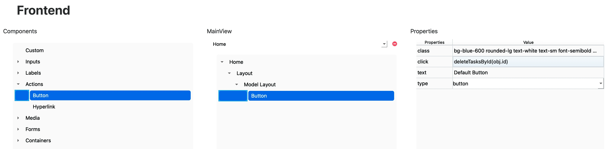

# Button

El componente **Button** permite ejecutar acciones dentro de la aplicación, como enviar formularios o eliminar registros de un modelo.  
Su comportamiento se define mediante la propiedad `click` o el atributo estándar `type`.

---

## 🧾 Propiedades

| Propiedad | Tipo   | Descripción                                                                 |
|-----------|--------|-----------------------------------------------------------------------------|
| `class`   | string | Clases de Tailwind CSS aplicadas al botón.                                  |
| `click`   | string | Acción que ejecutará el botón al hacer clic. Puede ser una función reservada como `deleteModelById(id)`. |
| `text`    | string | Texto que se mostrará dentro del botón.                                     |
| `type`    | enum   | Tipo del botón. Puede ser `submit`, `button`, etc.                          |

---

## 🛠️ Creación

Para insertar un botón en tu vista:

1. Abre el **Árbol de componentes**.
2. Arrastra el componente **Button** a la ubicación deseada dentro de la vista o de un formulario.

   

---

## 🧬 Código generado

Cuando se configura un botón con `click="deleteModelById(id)"`, RapidWebForge genera automáticamente la función `deleteModelById(id)` correspondiente al modelo activo.

```tsx
import TasksService from "../services/TasksService";
import Tasks, { TasksDefaults } from "../models/Tasks";
import React, { useState, useEffect } from "react";

export default function Home() {
	const [tasks, setTasks] = useState<Tasks[]>([]);
	useEffect(() => {
		TasksService.getAllTasks()
			.then((response) => setTasks(response))
			.catch((error) => console.error("Error fetching Tasks data:", error));
	}, []);
	const deleteTasksById = async (id: number) => {
		try {
			const response = await TasksService.deleteTasksById(id);
			console.log("Element deleted successfully:", response);
		} catch (error) {
			console.error("Error deleting element:", error);
		}
	};
	return (
		<div data-id="34313737-6361-3361-3039-363033383163">
			<div
				data-id="66616665-3763-3131-3430-353334346565"
				className="flex flex-col items-center"
				data-rwf-model="Tasks"
				data-rwf-get="ALL"
			>
				{tasks.map((obj, index) => (
					<div key={index}></div>
				))}
				<button
					className="bg-blue-600 rounded-lg text-white text-sm font-semibold hover:bg-blue-800 px-4 py-2 cursor-pointer"
					type="button"
					onClick={() => {
						deleteTasksById(obj.id);
					}}
					data-id="37303837-3835-3530-6633-393464313737"
				>
					Default Button
				</button>
			</div>
		</div>
	);
}
```

Esta función:

- Se conecta con el servicio del modelo (por ejemplo, `TasksService.deleteTasksById(id)`).
- Realiza una solicitud `DELETE` al backend.
- Puede incluir manejo de errores y feedback visual.

Además, si el botón se utiliza como `type="submit"` dentro de un formulario, servirá para enviar los datos del formulario usando la función `handleSubmit` generada por RapidWebForge.

En el ejemplo mostrado se inserta el `Button` dentro de un `Model Layout` para aprovechar el id del modelo.

---

## ✅ Resultado

Al insertar el componente `Button` mediante el editor visual, se generará:

- Un botón estilizado con Tailwind.
- Una acción asociada al evento `onClick`.
- El código necesario para ejecutar la acción vinculada (`submit` o `deleteModelById`).