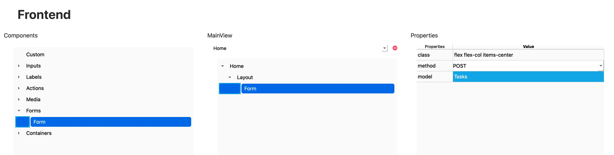

# Form

El componente **Form** permite a los usuarios ingresar datos a través de un formulario web. Es el encargado de interactuar con los **endpoints generados automáticamente** para realizar operaciones de **creación** (`POST`) y **actualización** (`PUT`) sobre un modelo de datos.

---

## 🧾 Propiedades

| Propiedad | Tipo   | Descripción                                                                 |
|-----------|--------|-----------------------------------------------------------------------------|
| `class`   | string | Clases de Tailwind CSS aplicadas al formulario.                             |
| `method`  | enum   | Método HTTP que se utilizará al enviar el formulario: `POST` o `PUT`.       |
| `model`   | string | Nombre del modelo de base de datos con el que se vinculará el formulario.   |

:::note

Para que el valor `PUT` en la propiedad `method` funcione correctamente, el formulario debe estar ubicado dentro de una vista con **parámetros en la ruta**, que incluya el identificador (`ID`) del modelo a editar.

La ruta debe seguir la estructura: `model{Id}`  
Por ejemplo: `/tasks/:taskId`

De este modo, RapidWebForge generará automáticamente el código necesario para **obtener los datos del modelo por su ID** y permitir su actualización mediante la operación `PUT`.

:::

---

## 🛠️ Creación

Para crear un formulario:

1. Accede al **Árbol de componentes**.
2. Arrastra el componente **Form** hasta la ubicación deseada dentro de la vista.

   

---

## 🧬 Código generado

Al agregar un formulario, RapidWebForge generará automáticamente el código necesario para la gestión del estado, el envío y el manejo de eventos.

### Método `POST`

```tsx
import TasksService from "../services/TasksService";
import Tasks, { TasksDefaults } from "../models/Tasks";
import React, { useState, useEffect } from "react";

export default function Home() {
	const [postTasks, setPostTasks] = useState<Tasks>(
		TasksDefaults.defaultPostTasks,
	);
	const handleSubmitPostTasks = async (e: React.FormEvent) => {
		e.preventDefault();
		if (!postTasks) {
			console.error("Data is undefined");
			return;
		}
		try {
			const response = await TasksService.createTasks(postTasks);
			console.log("Form submitted successfully:", response);
			alert("Element created successfully");
			setPostTasks(TasksDefaults.PostTasks);
		} catch (error) {
			console.error("Error submitting form:", error);
		}
	};
	const handleChangePostTasks = (e: any) => {
		const { name, value } = e.target;
		setPostTasks((prevData) => ({ ...prevData, [name]: value }));
	};
	return (
		<div data-id="34313737-6361-3361-3039-363033383163">
			<form
				data-id="64333966-6331-3130-6633-313661633830"
				className="flex flex-col items-center"
				onSubmit={handleSubmitPostTasks}
				data-rwf-method="POST"
				data-rwf-model="Tasks"
			></form>
		</div>
	);
}
```

En el ejemplo anterior, se ha utilizado un modelo llamado `Tasks`. A partir de este modelo, RapidWebForge ha generado automáticamente:

- `handleSubmitPostTasks`: función encargada de enviar los datos al endpoint correspondiente (`POST` en este caso).
- `handleChangePostTasks`: función que gestiona los cambios en los campos del formulario y actualiza el estado local.

Cada campo del formulario utilizará `handleChangePostTasks` como manejador de eventos `onChange`, lo cual permite mantener sincronizado el estado del formulario con los valores ingresados por el usuario.

Además, los atributos `data-rwf-model` y `data-rwf-method` permiten identificar y vincular el formulario con el modelo correspondiente y el método HTTP deseado, facilitando así la generación automatizada del código.

### Método `PUT`

```tsx
import TasksService from "../services/TasksService";
import Tasks, { TasksDefaults } from "../models/Tasks";
import React, { useEffect, useState } from "react";

import { useParams } from "react-router-dom";
export default function UpdateTasks() {
	const [putTasks, setPutTasks] = useState<Tasks>(
		TasksDefaults.defaultPutTasks,
	);
	const { tasksId } = useParams();
	useEffect(() => {
		TasksService.getTasksById(tasksId)
			.then((response) => {
				setPutTasks(response);
			})
			.catch((error) => {
				console.error("Error fetching Tasks data by id:", error);
			});
	}, [tasksId]);
	const handleSubmitPutTasks = async (e: React.FormEvent) => {
		e.preventDefault();
		if (!putTasks) {
			console.error("Data is undefined");
			return;
		}
		try {
			const response = await TasksService.updateTasksById(
				putTasks.id,
				putTasks,
			);
			console.log("Form submitted successfully:", response);
			alert("Element updated successfully");
		} catch (error) {
			console.error("Error submitting form:", error);
		}
	};
	const handleChangePutTasks = (e: any) => {
		const { name, value } = e.target;
		setPutTasks((prevData) => ({ ...prevData, [name]: value }));
	};
	return (
		<div data-id="64376164-3839-3635-3835-393836393939">
			<form
				data-id="33356338-3463-6163-3131-306438623038"
				className="flex flex-col items-center"
				onSubmit={handleSubmitPutTasks}
				data-rwf-method="PUT"
				data-rwf-model="Tasks"
			></form>
		</div>
	);
}
```

Cuando el formulario utiliza `method="PUT"`, RapidWebForge también genera un `useEffect` que se encarga de **obtener automáticamente los datos del modelo por su ID**, utilizando el servicio correspondiente.

Este efecto se ejecuta al montar el componente o cuando cambia el valor de `tasksId`, y realiza las siguientes acciones:

- Llama al endpoint `GET /tasks/:id` a través del servicio `TasksService.getTasksById`.
- Asigna la respuesta al estado `putTasks`, que es utilizado para mostrar los datos actuales del modelo en el formulario.

> ⚠️ Esta lógica se genera automáticamente **solo cuando el método del formulario es `PUT`** y la vista contiene un parámetro en la ruta con la estructura `modelId`.  
> Por ejemplo: `/tasks/:tasksId`

---

## ✅ Resultado

Al insertar el componente `Form` mediante el editor visual, obtendrás de forma automática:

- Un formulario React listo para usar.
- Funciones generadas para gestionar estado y envío de datos.
- Enlace directo al backend utilizando los endpoints creados por el modelo seleccionado.