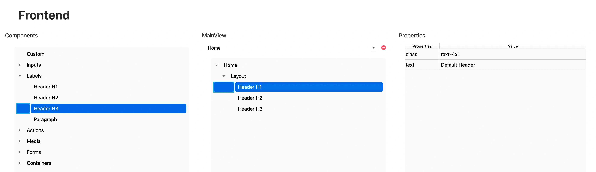

# Headers

Los componentes **Headers** permiten añadir títulos o subtítulos dentro de una vista. Aunque en HTML existen seis niveles (`h1` a `h6`), en RapidWebForge se utilizan los componentes `H1`, `H2` y `H3` como encabezados jerárquicos para estructurar el contenido visualmente.

---

## 🧾 Propiedades

| Propiedad | Tipo   | Descripción                                                                 |
|-----------|--------|-----------------------------------------------------------------------------|
| `class`   | string | Clases de Tailwind CSS aplicadas al encabezado.                             |
| `text`    | string | Contenido de texto que se mostrará dentro del encabezado.                   |

---

## 🛠️ Creación

Para insertar un encabezado en tu vista:

1. Abre el **Árbol de componentes**.
2. Arrastra el componente **Header** (`H1`, `H2` o `H3`) a la ubicación deseada dentro de la vista.

   

---

## 🧬 Código generado

```tsx
<h1 className="text-4xl" data-id="63353564-3932-3961-3930-323030653233">
    Default Header
</h1>
<h2 className="text-2xl" data-id="34336334-6538-6633-3639-356635383130">
    Default Header 2
</h2>
<h3 className="text-lg" data-id="64613339-3332-3234-3763-323331353761">
    Default Header 3
</h3>
```

RapidWebForge generará un encabezado HTML (`<h1>`, `<h2>`, o `<h3>`) con las clases de estilo especificadas.  
La jerarquía visual del título se definirá automáticamente según el tipo de Header seleccionado.

---

## ✅ Resultado

- Un encabezado con estilo personalizable.
- Texto estructurado para mejorar la jerarquía y legibilidad de la vista.
- Integración directa mediante el sistema visual de componentes de RapidWebForge.
