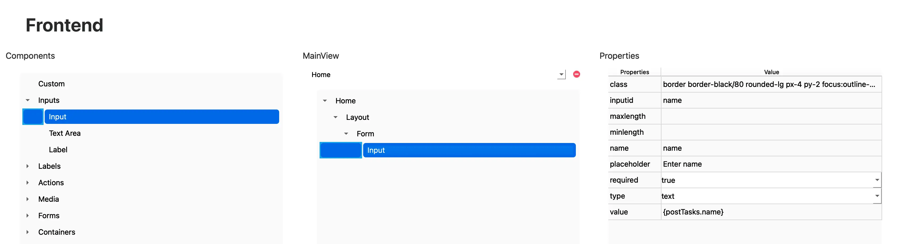

# Input

El componente **Input** permite capturar datos desde el usuario y asignarlos a un campo específico de un modelo de base de datos. Este componente debe utilizarse dentro de un **Form**, ya que aprovecha el estado y las funciones generadas para manejar la interacción con el backend.

---

## 🧾 Propiedades

| Propiedad     | Tipo     | Descripción                                                                 |
|---------------|----------|-----------------------------------------------------------------------------|
| `class`       | string   | Clases de Tailwind CSS aplicadas al input.                                 |
| `inputid`     | string   | Identificador único que vincula el input con un campo del modelo de datos. |
| `maxlength`   | number   | Número máximo de caracteres permitidos.                                     |
| `minlength`   | number   | Número mínimo de caracteres requeridos.                                     |
| `name`        | string   | Nombre del campo del modelo de base de datos al que se vinculará el input. |
| `placeholder` | string   | Texto de ayuda que se mostrará dentro del campo antes de ingresar datos.   |
| `required`    | boolean  | Indica si el campo es obligatorio.                                          |
| `type`        | enum     | Tipo de dato que acepta el input (por ejemplo: `text`, `number`, etc.).     |
| `value`       | string   | Valor actual del input, vinculado al estado del modelo.                    |

---

## 🛠️ Creación

Para insertar un campo de entrada en tu vista:

1. Abre el **Árbol de componentes**.
2. Arrastra el componente **Input** a la ubicación deseada dentro de un componente `Form`.

   

---

## 🧬 Código generado

Cuando se agrega un `Input` dentro de un componente `Form`, se generará automáticamente el manejador de cambios `onChange` vinculado al estado del modelo, así como el valor del campo correspondiente.

```tsx
<input
	className="border border-black/80 rounded-lg px-4 py-2 focus:outline-none focus:ring-2 focus:ring-blue-500 placeholder:text-gray-400"
	placeholder="Enter name"
	id="name"
	name="name"
	required
	type="text"
	value={postTasks.name}
	onChange={handleChangePostTasks}
	data-id="37383565-3830-6530-3730-306262306630"
/>
```

En este ejemplo, el input está vinculado al campo `name` del modelo `Tasks`.  
La propiedad `value` está conectada al estado `postTasks.name`, y el manejador `handleChangePostTasks` se encarga de actualizar ese estado automáticamente cada vez que el usuario modifica el valor.

> ⚠️ Nota: Los valores encerrados entre `{}` en JSX son expresiones, no strings literales. Por ejemplo, `{postTasks.name}` se interpreta como una referencia al valor del estado, **no como un string**.

---

## ✅ Resultado

Al insertar el componente `Input` mediante el editor visual:

- Se vinculará automáticamente con el modelo seleccionado.
- Se integrará al flujo de manejo de formularios (`onChange` y `value`).
- Se generará código React completamente funcional, listo para enviar los datos al backend.