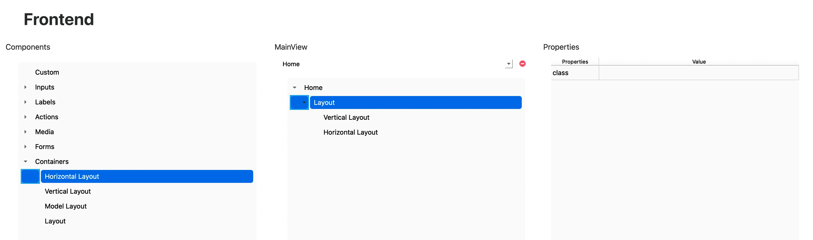

# Layouts

Los componentes **Layouts** permiten estructurar y organizar visualmente el contenido dentro de una vista.  
Estos componentes definen la disposición de los elementos que contienen, facilitando la creación de diseños responsivos y bien alineados.

En RapidWebForge se pueden utilizar diferentes tipos de Layouts, entre los cuales destacan:

- `Layout`: contenedor genérico sin dirección específica.
- `Horizontal Layout`: organiza los elementos de forma horizontal.
- `Vertical Layout`: organiza los elementos en dirección vertical.

---

## 🧾 Propiedades

| Propiedad | Tipo   | Descripción                                                        |
|-----------|--------|--------------------------------------------------------------------|
| `class`   | string | Clases de Tailwind CSS aplicadas al contenedor del layout.         |

---

## 🛠️ Creación

Para insertar un layout en tu vista:

1. Abre el **Árbol de componentes**.
2. Arrastra el componente **Layout** que desees (`Layout`, `Horizontal Layout` o `Vertical Layout`) hasta la ubicación deseada dentro de la vista.

   

---

## 🧬 Código generado

```tsx
<div data-id="39666633-6638-6163-3130-363731313261">
    <div
        data-id="66353038-6237-3961-6130-313561373736"
        className="flex flex-col"
    ></div>
    <div
        data-id="65386436-3131-3032-3738-623261396366"
        className="flex flex-row"
    ></div>
</div>
```

Al insertar un componente `Layout`, RapidWebForge generará un contenedor `div` con clases de Tailwind que determinan la dirección (`flex-col` para vertical o `flex-row` para horizontal), permitiendo que puedas agrupar y alinear otros componentes visualmente.

---

## ✅ Resultado

- Contenedores visuales reutilizables para estructurar la vista.
- Alineación automática de componentes según el tipo de Layout.
- Diseño flexible, fácilmente ajustable con clases de Tailwind CSS.
