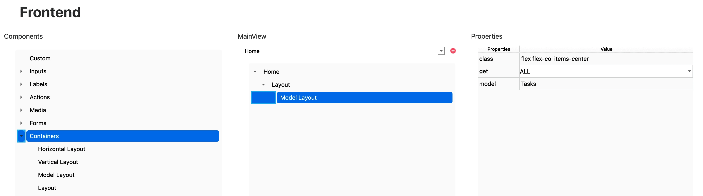

# Model Layout

El componente **Model Layout** permite renderizar una lista de elementos o un único registro de un modelo de base de datos, según el método de obtención configurado (`ALL` o `ID`). Es ideal para mostrar vistas dinámicas como listas, detalles o tarjetas generadas a partir de los datos obtenidos del backend.

---

## 🧾 Propiedades

| Propiedad | Tipo   | Descripción                                                                 |
|-----------|--------|-----------------------------------------------------------------------------|
| `class`   | string | Clases de Tailwind CSS aplicadas al contenedor principal.                   |
| `get`     | enum   | Define el tipo de consulta: `ALL` para obtener todos los elementos, o `ID` para obtener uno solo por su identificador. |
| `model`   | string | Nombre del modelo de base de datos con el que se vinculará el componente.   |

:::note
Para que la opción `get="ID"` funcione correctamente, la vista debe incluir un parámetro en la ruta con la estructura `modelId`.  
Por ejemplo: `/tasks/:tasksId`.  
Esto permite que RapidWebForge genere automáticamente el código necesario para obtener un único registro del modelo según su ID.
:::

---

## 🛠️ Creación

Para insertar un **Model Layout** en tu vista:

1. Abre el **Árbol de componentes**.
2. Arrastra el componente **Model Layout** a la ubicación deseada en tu vista.

   

---

## 🧬 Código generado

### Get ALL

```tsx
import TasksService from "../services/TasksService";
import Tasks, { TasksDefaults } from "../models/Tasks";
import React, { useState, useEffect } from "react";

export default function Home() {
	const [tasks, setTasks] = useState<Tasks[]>([]);
	useEffect(() => {
		TasksService.getAllTasks()
			.then((response) => setTasks(response))
			.catch((error) => console.error("Error fetching Tasks data:", error));
	}, []);
	return (
		<div data-id="34313737-6361-3361-3039-363033383163">
			<div
				data-id="66616665-3763-3131-3430-353334346565"
				className="flex flex-col items-center"
				data-rwf-model="Tasks"
				data-rwf-get="ALL"
			>
				{tasks.map((obj, index) => (
					<div key={index}></div>
				))}
			</div>
		</div>
	);
}
```

En este ejemplo, el `Model Layout` está configurado con el modelo `Tasks` y la propiedad `get="ALL"`, lo que genera una llamada al servicio `getAllTasks()` mediante `useEffect`.

La respuesta es almacenada en el estado `tasks` y utilizada para renderizar dinámicamente cada elemento del modelo usando `.map()`.

### Get ID

```tsx
import TasksService from "../services/TasksService";
import Tasks, { TasksDefaults } from "../models/Tasks";
import React, { useEffect, useState } from "react";

import { useParams } from "react-router-dom";
export default function UpdateTasks() {
	const [tasks, setTasks] = useState<Tasks>();
	const { tasksId } = useParams();
	useEffect(() => {
		TasksService.getTasksById(tasksId)
			.then((response) => setTasks(response))
			.catch((error) => console.error("Error fetching Tasks by id:", error));
	}, [tasksId]);

	return (
		<div data-id="64376164-3839-3635-3835-393836393939">
			<div
				data-id="30616230-3338-6166-3261-303661386539"
				className="flex flex-col items-center"
				data-rwf-model="Tasks"
				data-rwf-get="ID"
			></div>
		</div>
	);
}
```

---

## ✅ Resultado

Al usar el componente `Model Layout`, RapidWebForge genera:

- El hook `useEffect` para obtener los datos del modelo desde el backend.
- La llamada automática al servicio generado por el modelo (`getAll` o `getById`).
- Un contenedor listo para mapear o mostrar los datos obtenidos.
- Una estructura base fácilmente personalizable para renderizar tarjetas, listas o detalles.