# Plantilla CRUD

RapidWebForge incluye una plantilla de tipo **CRUD** (Create, Read, Update, Delete) que permite crear rápidamente un proyecto funcional de gestión de datos con backend, frontend y base de datos integrados.

---

## 🚀 Crear un proyecto CRUD

Sigue los pasos a continuación para generar un proyecto usando esta plantilla:

1. Abre la aplicación **RapidWebForge**.

   

2. Dirígete a la sección **Templates**.

   

3. Haz clic en la opción **CRUD** para iniciar la creación del proyecto.

4. Completa los datos requeridos en el formulario de creación.

---

## 🧩 Estructura del proyecto generado

La plantilla CRUD genera por defecto un backend funcional con base de datos y un frontend con vistas básicas.

### 🔙 Backend

El backend incluye una tabla llamada **Products**, que contiene los siguientes campos:

- `name`: Nombre del producto  
- `description`: Descripción del producto  
- `amount`: Cantidad disponible

   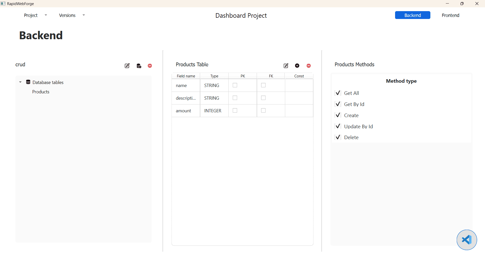

---

### 🖥️ Frontend

Se crean automáticamente tres vistas funcionales:

1. **Home**  
   Muestra una tabla con todos los productos registrados.

   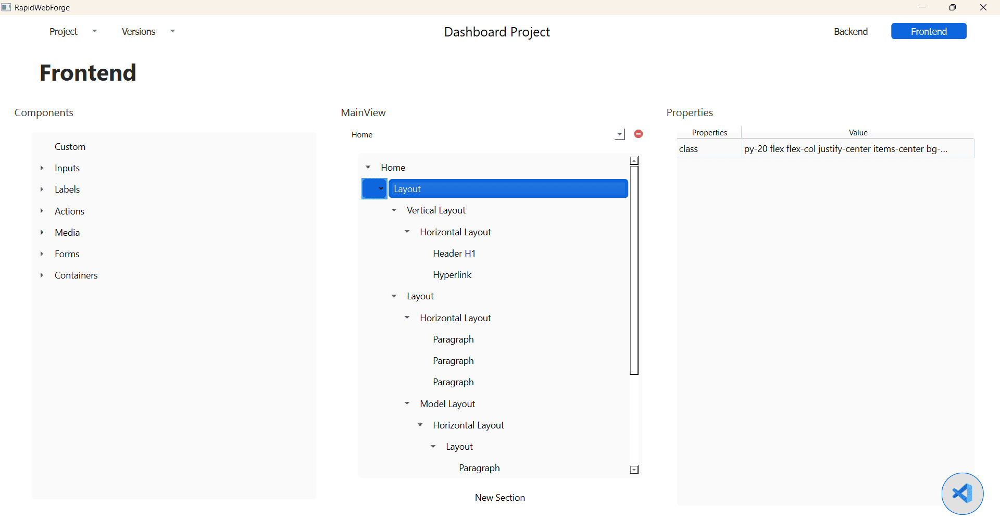

2. **Create**  
   Permite crear un nuevo producto a través de un formulario.

   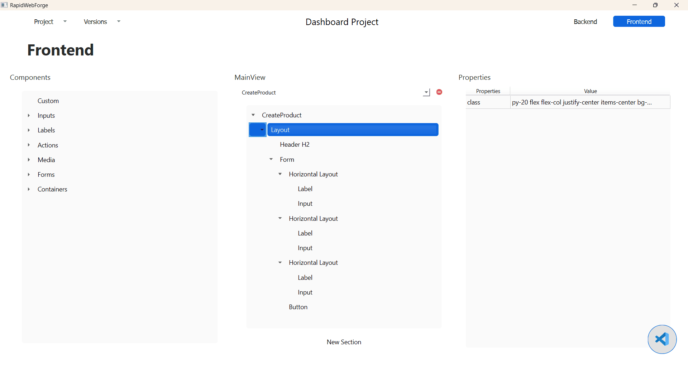

3. **Update**  
   Permite editar los datos de un producto existente.

   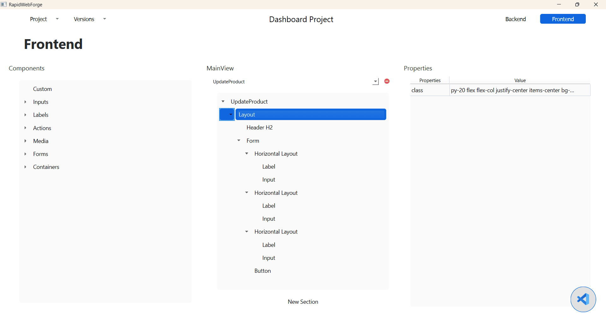

---

## ⚙️ Desplegar el proyecto CRUD

Para ejecutar el proyecto CRUD de forma local:

1. Accede al menú **Project** en la barra superior.

   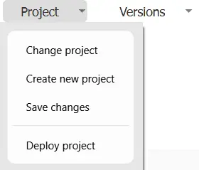

2. Selecciona la opción **Deploy**.

   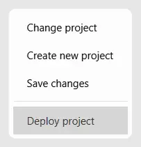

Esto desplegará la aplicación localmente utilizando **Nginx** con una configuración predeterminada.  
Cuando finalice el proceso, se mostrará una notificación de éxito.

Abre un navegador y visita:  
👉 [`http://localhost`](http://localhost)

   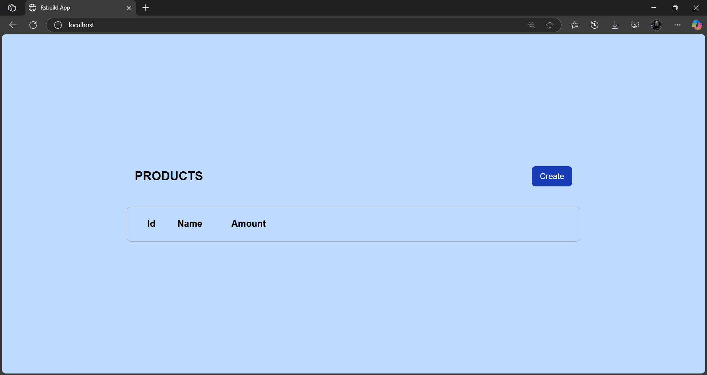

La vista inicial muestra una tabla vacía. Para agregar productos:

---

## ➕ Crear un nuevo producto

1. Haz clic en el botón **Create** para ir a la ruta `/create`.

   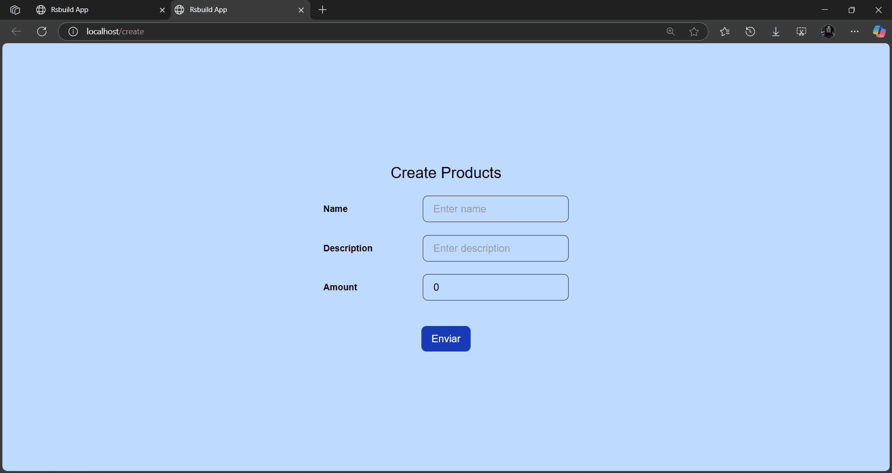

2. Completa los campos del formulario y haz clic en **Create**.

   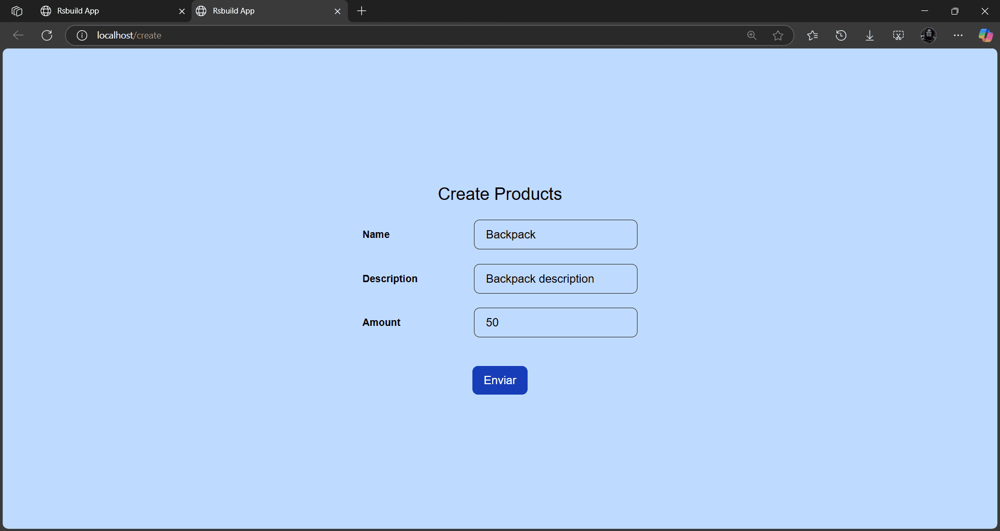

Se mostrará un mensaje de éxito y el formulario se reiniciará.

---

## 📄 Ver y editar productos

1. Regresa a la ruta raíz `/` y recarga la página.

   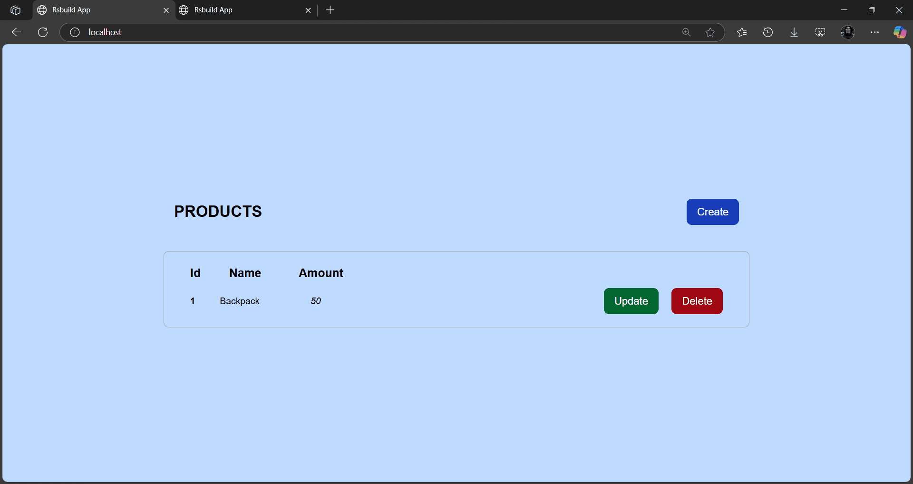

2. Para editar un producto, haz clic en **Edit**. Serás redirigido a `/update`.

   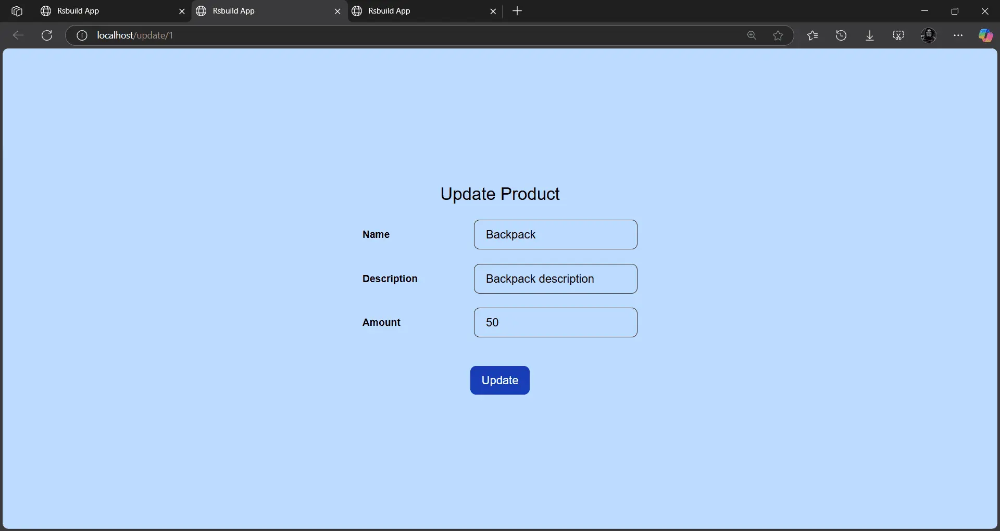

3. Modifica los datos necesarios y haz clic en **Update**.  
   Se mostrará una alerta de confirmación, y los cambios se reflejarán en la tabla.

---

## ❌ Eliminar productos

En la tabla de productos se mostrará un botón **Delete** para cada registro.  
Haz clic en él para eliminar el producto de la base de datos.  
Se actualizará la tabla automáticamente.

---

## 🧪 Verificación con MySQL Workbench

Puedes comprobar los datos registrados directamente desde **MySQL Workbench**.

   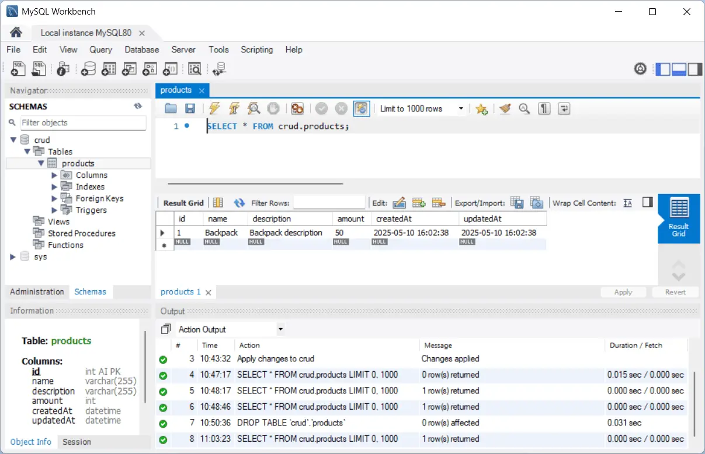

Verás la tabla `Products` con los registros creados desde la interfaz CRUD de RapidWebForge.

---

## ✅ Conclusión

La plantilla CRUD de RapidWebForge te permite crear proyectos listos para gestionar datos con:

- Backend en **Express**
- Base de datos en **MySQL**
- Frontend en **React**
- Despliegue local mediante **Nginx**

Ideal para pruebas rápidas, aprendizaje o prototipos funcionales sin escribir código manualmente.