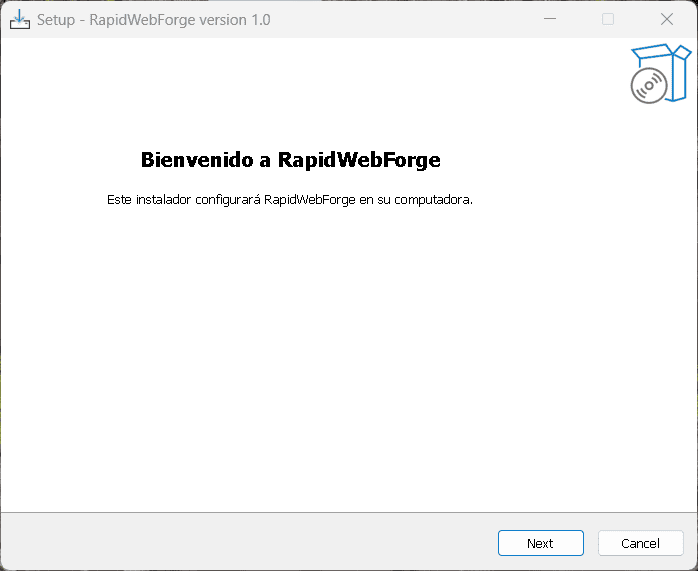
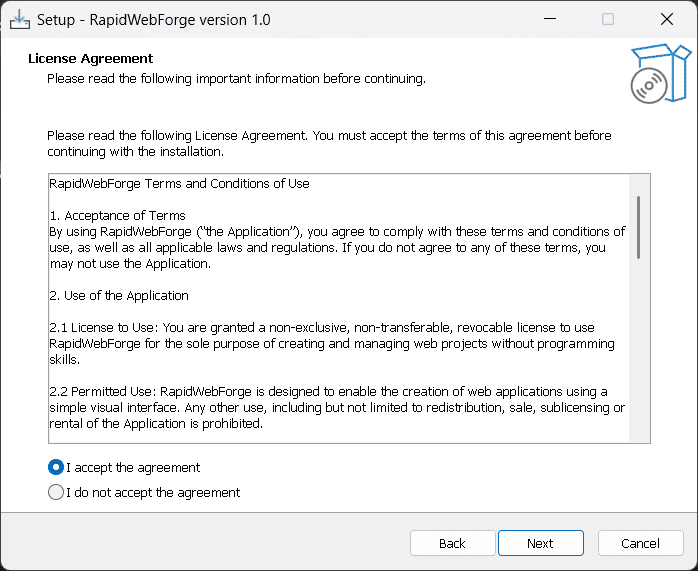
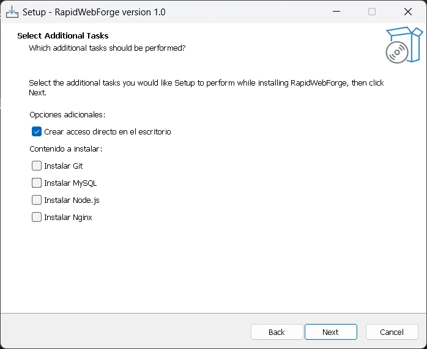
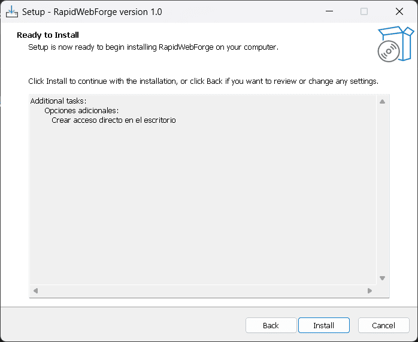
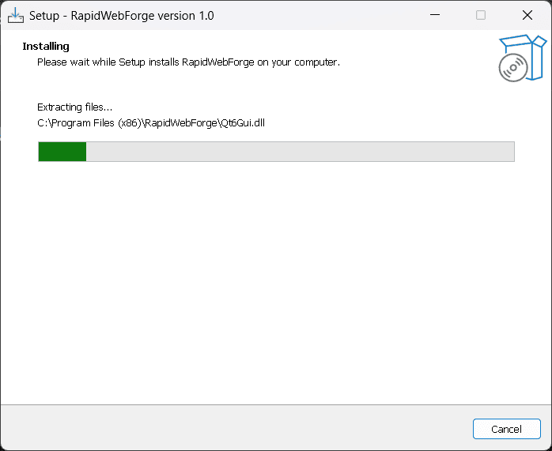
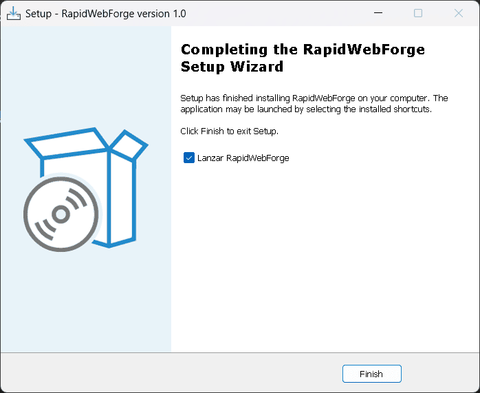
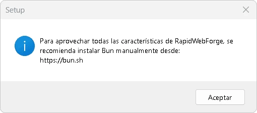

# Instalación de RapidWebForge

Sigue los siguientes pasos para instalar RapidWebForge en tu equipo.

---

## Descarga de RapidWebForge

Abre tu navegador y visita [rapidwebforge.netlify.app](https://rapidwebforge.netlify.app/).  
Haz clic en el botón **Descargar** para obtener el instalador.

---

## Instalación de RapidWebForge

### 1. Ejecutar el instalador

Abre el archivo `.exe` descargado y haz clic en **Next**.



---

### 2. Aceptar el acuerdo de licencia

Lee y acepta el acuerdo de licencia para continuar.



---

### 3. Elegir herramientas adicionales

Puedes elegir instalar las siguientes herramientas adicionales:

- **Git:** Para la gestión de versiones de proyectos.
- **MySQL:** Para la creación y administración de bases de datos.
- **Nginx:** Para el despliegue local de aplicaciones web.

Estas herramientas son necesarias para que RapidWebForge funcione correctamente.  
Puedes optar por instalarlas automáticamente o hacerlo manualmente más adelante.



---

### 4. Preparar la instalación

El instalador configurará los componentes seleccionados.



---

### 5. Proceso de instalación

RapidWebForge comenzará la instalación de los archivos seleccionados.



---

### 6. Finalizar la instalación

Al terminar, puedes elegir abrir RapidWebForge inmediatamente.



---

## Instalación de Bun

Bun es un motor de ejecución que permite compilar y correr aplicaciones web generadas por RapidWebForge de manera eficiente.

Al finalizar la instalación de RapidWebForge, se mostrará un mensaje indicando que es necesario instalar Bun.



:::note
⚠️ **Nota:** La instalación de Bun requiere permisos de administrador.  
Por ello, se mostrará un mensaje indicando que es necesario instalar Bun manualmente.
:::

```bash
powershell -c "irm bun.sh/install.ps1 | iex"
