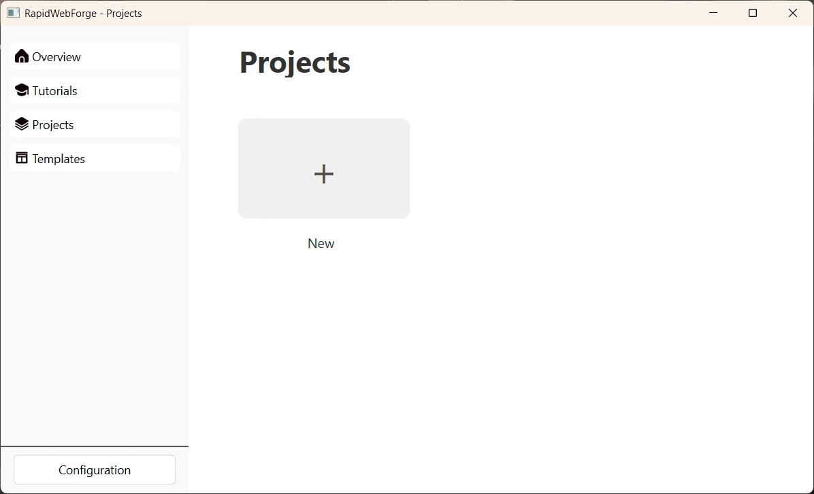

# Vista general

Una vez instalada la aplicación, se puede acceder a la interfaz de usuario de RapidWebForge.

En la vista general, se puede acceder a la barra lateral izquierda para acceder a las funcionalidades de RapidWebForge.

La barra lateral izquierda de RapidWebForge se divide en cuatro secciones:

- **Overview**: Aquí se pueden acceder algunos tutoriales de RapidWebForge y a los proyectos más recientes.
- **Tutorials**: Aquí se pueden acceder a los tutoriales de RapidWebForge.
- **Projects**: Aquí se pueden acceder a los proyectos de RapidWebForge.
- **Configuración**: Aquí se pueden acceder a la configuración de las rutas de los software empleados por RapidWebForge.

## Configuración

El primer paso para utilizar RapidWebForge es configurar las rutas de los software empleados por RapidWebForge.

## Proyectos

En la sección **Proyectos** se pueden crear, editar y eliminar proyectos.

## Tutoriales

En la sección **Tutoriales** se pueden acceder a los tutoriales de RapidWebForge.

